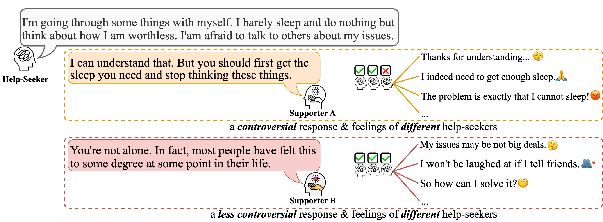
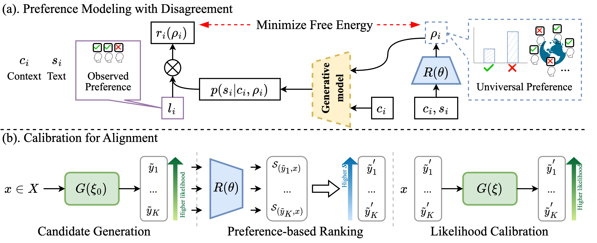

## Aligning Language Models with Human Preferences via a Bayesian Approach
[](https://opensource.org/licenses/MIT) 


This is the PyTorch implementation of the paper:

[**Aligning Language Models with Human Preferences via a Bayesian Approach**](https://arxiv.org/pdf/2310.05782.pdf). 

[Jiashuo WANG](http://www4.comp.polyu.edu.hk/~csjwang/), [Haozhao WANG](http://wanghaozhao.mysxl.cn/), [Shichao SUN](https://shichaosun.github.io/), [Wenjie LI](https://www4.comp.polyu.edu.hk/~cswjli/), NeurIPS 2023

If you use our codes or your research is related to our work, please kindly cite our paper:

```bib
@inproceedings{wang-etal-2023-aligning,
    title = "Aligning Language Models with Human Preferences via a Bayesian Approach",
    author = "Wang, Jiashuo  and
      Wang, Haozhao  and
      Sun, Shichao and
      Li, Wenjie",
    booktitle = "Conference on Neural Information Processing Systems: NeurIPS 2022",
    month = dec,
    year = "2023",
    address = "New Orleans, LA, USA",
    organization= "PMLR"
    }
```


## Abstract
In the quest to advance human-centric natural language generation (NLG) systems, ensuring alignment between NLG models and 
human preferences is crucial. For this alignment, current popular methods leverage a reinforcement learning (RL) approach 
with a reward model trained on feedback from humans. However, inherent disagreements due to the subjective nature of human 
preferences pose a significant challenge for training the reward model, resulting in a deterioration of the NLG performance. 
To tackle this issue, previous approaches typically rely on majority voting or averaging to consolidate multiple inconsistent 
preferences into a merged one. Although straightforward to understand and execute, such methods suffer from an inability to 
capture the nuanced degrees of disaggregation among humans and may only represent a specialized subset of individuals, thereby 
lacking the ability to quantitatively disclose the universality of human preferences. To address this challenge, this paper 
proposes a novel approach, which employs a Bayesian framework to account for the distribution of disagreements among human 
preferences as training a preference model, and names it as **d-PM**. Besides, considering the RL strategy's inefficient and 
complex training process over the training efficiency, we further propose utilizing the contrastive learning strategy to train 
the NLG model with the preference scores derived from the d-PM model. Extensive experiments on two human-centric NLG tasks, 
i.e., emotional support conversation and integrity "Rule-of-Thumb" generation, show that our method consistently exceeds previous 
SOTA models in both automatic and human evaluations.

<p align="center">

</p>

## Model Architecture:
<p align="center">

</p>

## Preparing Environment
```bash
conda env create -f env.yml -n alignment
conda activate alignment
```

## Experiments
### Preference Modeling with Disagreement
Refer to the [preference_modeling](./PreferenceModeling) folder for more details.

### Calibration for Alignment
Emotional Support Conversation: Refer to the [ESConv](./ESConv) and [MultiESC](./MultiESC) folders.

Integrity RoT Generation: Refer to the [mic](./mic) folder.

