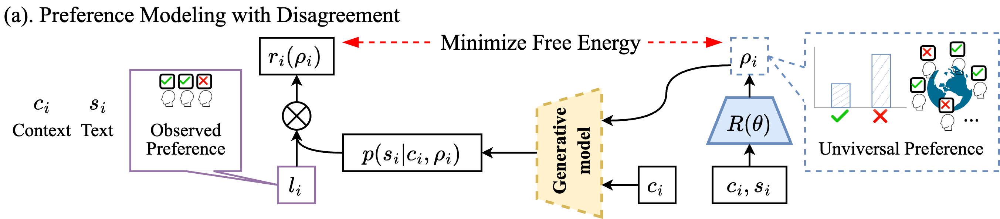

## Preference Modeling



### Requirements

### Data Download

Download [MI Dataset.csv](https://github.com/anuradha1992/Motivational-Interviewing-Dataset/blob/main/MI%20Dataset.csv)
and [MIC.csv](https://www.dropbox.com/sh/m46z42nce8x0ttk/AABuSZiA6ESyrJNWmgTPrfuRa?dl=0) and put them in
the `dataset/esc` and `dataset/mic`, respectively.

### Dara Preprocessing

Run the following two programs to generate the data for training and validation.

```console
❱❱❱ CUDA_VISIBLE_DEVICES=0 python -m dataset.esc
❱❱❱ CUDA_VISIBLE_DEVICES=1 python -m dataset.mic
❱❱❱ CUDA_VISIBLE_DEVICES=2 python -m dataset.single
```

### Model Training

Run the following two programs to train the d-PM model.

```console
❱❱❱ CUDA_VISIBLE_DEVICES=0 python -m train_dPM --task_name=esc --mode=d-PM
❱❱❱ CUDA_VISIBLE_DEVICES=1 python -m train_dPM --task_name=mic --mode=d-PM
```

`--mode` can be changed to "soft" or "major" for different preference models.

Checkpoints will be saved in `output`.